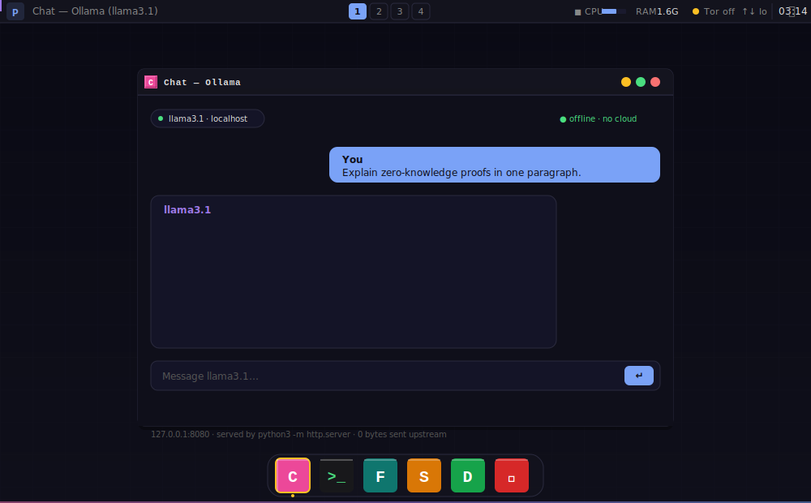

# 🔒 PAI — PAI


<p align="center">
  <a href="https://github.com/nirholas/pai/releases/latest"></a>
  <a href="LICENSE"></a>
</p>

<p align="center">
  
  
  
  
  <a href="LICENSE"></a>
</p>

<p align="center">
  <strong>Private AI on a bootable USB drive.</strong><br>
  <em>Your secure, offline-first AI assistant — carry it anywhere, leave no trace.</em>
</p>

<p align="center">
  <strong>A complete computer. In your pocket.</strong><br>
  <em>PAI is an entire operating system — lean enough to fit on a USB stick, powerful enough to run local AI. Forgot your laptop? Plug the drive into any machine and you're home.</em>
</p>

<p align="center">
  <a href="#quick-start">Quick Start</a> ·
  <a href="#what-is-pai">What is PAI?</a> ·
  <a href="#architecture">Architecture</a> ·
  <a href="#privacy--security-model">Security Model</a> ·
  <a href="#included-software">Included Software</a> ·
  <a href="#try-in-a-vm">Try in a VM</a> ·
  <a href="#flash-to-usb">Flash to USB</a> ·
  <a href="#build-from-source">Build from Source</a> ·
  <a href="#contributing">Contributing</a>
</p>

---

## Quick Start

```bash
# One-command download and flash (Linux/macOS):
curl -fsSL https://raw.githubusercontent.com/nirholas/pai/main/scripts/flash.sh | sudo bash
```

Or manually:

```bash
# Download the ISO
curl -LO https://github.com/nirholas/pai/releases/latest/download/pai.iso

# Flash to USB (replace /dev/sdX with your USB device)
sudo dd if=pai.iso of=/dev/sdX bs=4M status=progress && sync
```

Then reboot, select USB from your boot menu (F12/F2/DEL), and you're in.

> **Windows?** Download the ISO + [Rufus](https://rufus.ie/), select your USB, click Start.

---

## What is PAI? 

PAI is a **bootable live USB operating system** built on Debian 12 that gives you a private, portable AI workstation. Plug it into any x86_64 PC, boot from USB, and you have:

- **An offline AI assistant** running locally via [Ollama](https://ollama.com/) — no cloud, no API keys, no data leaving your machine
- **A privacy-hardened environment** with MAC spoofing, firewall, and Tor integration
- **A complete desktop** with Sway (Wayland), Firefox ESR, and essential tools
- **Zero installation** — nothing touches the host machine's hard drive

Like [Tails](https://tails.net/) is to privacy-focused browsing, **PAI is to private AI**. It combines the amnesic, leave-no-trace philosophy of Tails with the power of local large language models.

### A computer you can carry anywhere

Take a second to sit with what this is: **a full desktop operating system that fits on a USB stick**. Not a recovery disk. Not a rescue tool. Not a stripped-down appliance. A real, working computer — desktop, browser, terminal, files, local AI — on a piece of plastic you can slip into a pocket or a wallet.

- **Forgot your laptop?** Plug PAI into any x86_64 machine — a library PC, a hotel business-center terminal, a friend's desktop, an airport kiosk — and you're home. Same desktop, same AI, same environment. Pull the stick when you leave; the host remembers nothing.
- **Travel lighter than light.** A 16 GB USB drive weighs a few grams and holds the entire OS, the AI, and every tool you need to get work done.
- **Your environment goes where you go.** Boot, work, shut down, take the drive with you. No syncing, no accounts, no cloud.

This is the headline feature, and it bears repeating: PAI is a legit computer on your USB drive. Lean enough to fit, powerful enough to run local LLMs, portable enough to forget you're carrying it.

### The Problem

Every major AI service — ChatGPT, Claude, Gemini — requires sending your prompts, documents, and conversations to remote servers operated by third parties. You have no control over:

- **Who reads your data** — your prompts are processed on hardware you don't own
- **How long it's stored** — retention policies change, breaches happen
- **Who it's shared with** — training data pipelines, government requests, partnerships
- **Where it goes** — cross-border data transfers, jurisdictional exposure

Even "private" or "enterprise" tiers ultimately require trust in a corporation's infrastructure and policies.

### The Solution

PAI eliminates the entire trust chain:

| | Cloud AI | PAI |
|---|---|---|
| **Where your prompts go** | Remote servers | Nowhere — stays on your hardware |
| **Who can read them** | The provider, their employees, subprocessors | Only you |
| **Network required** | Always | Never (fully offline) |
| **Traces left behind** | Server logs, training data, analytics | None — RAM is wiped on shutdown |
| **Cost** | $20–200/month | Free forever |
| **Data jurisdiction** | Wherever their servers are | Wherever you are |

Your conversations exist only in RAM while PAI is running. Shut down, and they're gone. No logs, no history, no server-side copies. The machine doesn't even know PAI was there.

---

## How It Works

<p align="center">
  
</p>

PAI boots entirely into RAM from the USB drive. The host machine's hard drive is **never mounted, read, or written to**. When you shut down, all memory is cleared. The host operating system resumes as if nothing happened.

---

## Architecture

> The system architecture, threat model, and significant design choices
> are documented under [docs/](docs/).

### Boot Sequence

```
USB plugged in → BIOS/UEFI selects USB → GRUB/ISOLINUX loads kernel
    → Debian live-boot mounts squashfs from USB
    → systemd starts services:
        1. MAC address randomization (pai-mac-spoof.service)
        2. UFW firewall (deny incoming, allow outgoing, localhost only)
        3. Ollama LLM server (localhost:11434)
        4. Chat UI web server (localhost:8080)
        5. NetworkManager (Wi-Fi/Ethernet)
    → Auto-login on tty1 → Sway (Wayland) launches
    → Firefox ESR opens to localhost:8080 (Chat UI)
```

### Build System

PAI is built using [Debian live-build](https://live-team.pages.debian.net/live-manual/), the same toolchain used by Debian, Tails, and Kali Linux. The build process:

1. **Bootstrap** — debootstraps a minimal Debian 12 root filesystem
2. **Chroot** — installs packages and runs hook scripts inside the chroot:
   - `0100` — Installs Ollama (with GPU lib cleanup for CPU-only operation)
   - `0200` — Deploys Chat UI + systemd services
   - `0300` — Configures Sway desktop environment
   - `0350` — Sets up passwordless auto-login
   - `0400` — Plymouth boot splash
   - `0450` — MAC address spoofing service
   - `0500` — UFW firewall hardening
   - `0550` — Tor transparent proxy (opt-in)
   - `0600` — Electrum Bitcoin wallet
   - `0610` — Monero wallet
   - `0650` — AI tools suite
   - `0710` — Development languages
   - `0730` — Git tools
   - `0740` — Terminal enhancements
   - `0750` — Media applications
   - `0800` — Network privacy tools
   - `0830` — Encryption (GnuPG, LUKS)
   - `0840` — System utilities
3. **Cleanup** — strips GPU libs (~2GB), docs, man pages, non-English locales, caches
4. **Binary** — compresses the filesystem into squashfs, generates hybrid ISO

### ISO Variants

| Build | Size | Packages | Disk Required |
|---|---|---|---|
| **Minimal** | ~912 MB | ~20 packages (Sway, Firefox, Ollama, networking) | 32 GB |
| **Full** | ~4–6 GB | 100+ packages (all hooks enabled) | 64 GB+ |

The minimal build is the current default. It boots in under 30 seconds and runs Ollama + Chat UI with ~1.5 GB of free RAM on a 4 GB machine.

---

## Privacy & Security Model

PAI implements defense-in-depth across multiple layers. The goal is not just privacy but **operational security** — making it difficult for an adversary to determine what you did, when, or where.

### Layer 1: Amnesic by Design

Like Tails, PAI is **amnesic**. It runs entirely from RAM and the read-only squashfs on the USB drive.

- **No hard disk access** — the host machine's drives are never mounted
- **RAM-only operation** — all state exists only in volatile memory
- **Clean shutdown** — powering off clears all RAM, destroying:
  - Chat history and AI conversations
  - Downloaded files and browser history
  - Wi-Fi credentials and network logs
  - Every keystroke and mouse movement

There is no forensic residue. The machine returns to its pre-boot state.

> **Future**: Optional encrypted persistent storage (LUKS) on the USB drive for saving models and configuration across sessions.

### Layer 2: Network Anonymity

| Feature | Implementation | Default State |
|---|---|---|
| **MAC spoofing** | `macchanger` via `pai-mac-spoof.service` | ✅ Active on every boot |
| **Firewall** | `ufw` — deny incoming, allow outgoing, localhost only | ✅ Active on every boot |
| **Tor routing** | Transparent proxy via `tor` + `iptables` | ⬡ Opt-in (`sudo pai-privacy on`) |
| **DNS privacy** | Tor DNS resolution when privacy mode is active | ⬡ Opt-in |
| **Wi-Fi randomization** | NetworkManager `cloned-mac-address=random` | ✅ Active on every boot |

**MAC spoofing** randomizes your hardware address on every boot. The access point, ISP, and any local network observer sees a different device each time. Combined with Tor, your traffic is encrypted through three relays — no single relay knows both your identity and your destination.

**Firewall** denies all incoming connections by default. Ollama and the Chat UI listen only on `localhost` — they are not accessible from the network, even on the local subnet.

### Layer 3: Local-Only AI

The AI runs **entirely on-device** using [Ollama](https://ollama.com/). No tokens, no API keys, no cloud dependencies.

- **Model execution**: CPU-only (GPU libs stripped to save space)
- **Model storage**: Pulled into RAM or persistent storage on first use
- **Network**: Ollama never phones home. It binds to `127.0.0.1:11434`
- **Supported models**: Any GGUF-compatible model — Llama 3.1, Mistral, Phi-3, Gemma, Qwen, DeepSeek, etc.
- **Chat UI**: Lightweight HTML interface served by Python's `http.server` on `localhost:8080`

The trade-off is speed — CPU inference on a laptop is 5–20 tokens/sec depending on the model and hardware. A 7B parameter model runs comfortably on 8 GB RAM. For faster inference, use a machine with more cores or AVX-512 support.

### Layer 4: Hardened Defaults

```
┌─────────────────────────────────────────────┐
│              Security Defaults              │
├─────────────────────────────────────────────┤
│ ✓ MAC randomized on every boot              │
│ ✓ Firewall: deny incoming, localhost only   │
│ ✓ No SSH server enabled by default          │
│ ✓ GPG configured with SHA-512 + AES-256     │
│ ✓ Tor pre-configured (opt-in activation)    │
│ ✓ WireGuard available for VPN tunnels       │
│ ✓ LUKS available for encrypted volumes      │
│ ✓ No telemetry, no analytics, no phoning    │
│   home — ever                               │
│ ✓ Firefox ESR with hardened policies        │
│ ✓ Automatic memory wipe on shutdown         │
└─────────────────────────────────────────────┘
```

### Threat Model

**PAI protects against:**
- Network surveillance (MAC spoofing + Tor + encrypted DNS)
- Forensic analysis of the host machine (amnesic, no disk writes)
- Cloud AI data harvesting (all inference is local)
- Tracking across sessions (new MAC, clean browser, no cookies)
- Local network attacks on AI services (firewall blocks all incoming)

**PAI does NOT protect against:**
- Physical keyloggers or hardware implants on the host machine
- Compromised BIOS/UEFI firmware
- Shoulder surfing or screen recording
- Adversaries who control your ISP and the exit node simultaneously (Tor limitation)
- Cold boot attacks on RAM (mitigated by full shutdown, not sleep)
- A compromised USB drive (verify ISO checksums before flashing)

This is not a silver bullet. PAI raises the cost of surveillance significantly, but determined nation-state adversaries with physical access to your hardware can still compromise you. For maximum security, use PAI on hardware you control and trust, on a network you manage, with Tor enabled.

---

## Included Software

### AI & Productivity

| Software | Purpose |
|---|---|
| [Ollama](https://ollama.com/) | Local LLM inference engine — runs Llama, Mistral, Phi, Gemma, etc. |
| Chat UI | Lightweight web interface for conversing with Ollama models |
| Firefox ESR | Privacy-focused web browser with hardened policies |
| PCManFM | Lightweight file manager |
| Mousepad | Simple text editor |
| File Roller | Archive manager (zip, tar, gzip) |

### Privacy & Security

| Software | Purpose |
|---|---|
| [Tor](https://www.torproject.org/) | Anonymous communication — transparent proxy mode |
| [UFW](https://wiki.ubuntu.com/UncomplicatedFirewall) | Firewall — deny incoming by default |
| [macchanger](https://github.com/alobbs/macchanger) | MAC address randomization |
| [WireGuard](https://www.wireguard.com/) | Modern VPN tunneling |
| [GnuPG](https://gnupg.org/) | OpenPGP encryption and signing |
| [LUKS/cryptsetup](https://gitlab.com/cryptsetup/cryptsetup) | Disk encryption |
| [Electrum](https://electrum.org/) | Lightweight Bitcoin wallet |
| Monero Wallet | Private cryptocurrency wallet |

### Desktop Environment

| Software | Purpose |
|---|---|
| [Sway](https://swaywm.org/) | Wayland tiling compositor (i3-compatible) |
| [foot](https://codeberg.org/dnkl/foot) | Fast, lightweight Wayland terminal |
| [Waybar](https://github.com/Alexays/Waybar) | Status bar for Sway |
| [swaylock](https://github.com/swaywm/swaylock) | Screen locker |
| [xwayland](https://wayland.freedesktop.org/xserver.html) | X11 compatibility layer |

### Development

| Software | Purpose |
|---|---|
| [Git](https://git-scm.com/) + [Git LFS](https://git-lfs.com/) | Version control |
| OpenSSH | SSH client and server |
| Python 3 | Scripting runtime |
| curl, wget, htop, jq | Essential CLI utilities |

### Networking

| Software | Purpose |
|---|---|
| NetworkManager | Wi-Fi and Ethernet management |
| wpasupplicant | WPA/WPA2 authentication |
| wireless-tools | Wi-Fi diagnostics |

---

## Try in a VM

Want to kick the tires before flashing a USB? PAI boots fine in a virtual machine — handy for testing, demos, or development.

### UTM (macOS, Apple Silicon + Intel)

[UTM](https://mac.getutm.app/) is a free QEMU-based VM app for macOS.

1. Download the [PAI ISO](https://github.com/nirholas/pai/releases/latest/download/pai.iso)
2. Open UTM → **Create a New Virtual Machine** → **Emulate** → **Other**
3. Select **Boot from ISO** and pick the PAI ISO
4. Recommended resources: **4 GB RAM**, **2+ CPU cores**
5. Architecture: **x86_64** (works on both Apple Silicon via emulation and Intel Macs)
6. Start the VM — PAI boots straight into Sway + the Chat UI

> On Apple Silicon, x86_64 emulation is slower than native — fine for testing the UI, but AI inference will crawl. For faster inference on M-series, wait for the ARM64 build (on the [roadmap](#roadmap)).

### QEMU (Linux / macOS / Windows)

```bash
qemu-system-x86_64 \
  -cdrom pai.iso \
  -m 4096 \
  -smp 2 \
  -enable-kvm    # Linux only; omit on macOS/Windows
```

### VM caveats

- **No MAC spoofing benefit** — the VM's virtual NIC is already isolated from your host
- **Performance** — CPU-only inference is slow under emulation; expect 1–5 tokens/sec for 7B models
- **Secure Boot** — disable it in the VM firmware if prompted
- **Graphics** — Sway is configured to fall back to software rendering automatically if the VM has no GPU

---

## Flash to USB

### Requirements

- **USB drive**: 2 GB minimum (8 GB+ recommended for downloading models)
- **Target machine**: x86_64 (Intel or AMD, 64-bit)
- **RAM**: 2 GB minimum, 4 GB+ recommended for AI inference

### Method 1: Auto-Flasher Script (Linux/macOS)

The auto-flasher downloads the ISO, detects USB drives, and writes it — one command:

```bash
curl -fsSL https://raw.githubusercontent.com/nirholas/pai/main/scripts/flash.sh | sudo bash
```

The script will:
1. Detect your OS
2. Scan for removable USB drives
3. Show you the options and ask you to confirm
4. Stream the ISO directly to the drive (no local file needed)

> **Always inspect scripts before piping to bash**: `curl -fsSL https://raw.githubusercontent.com/nirholas/pai/main/scripts/flash.sh | less`

### Method 2: Manual Download + dd (Linux)

```bash
# Find your USB device
lsblk -d -o NAME,SIZE,MODEL,TRAN | grep usb

# Unmount if mounted
sudo umount /dev/sdX*

# Flash
sudo dd if=pai.iso of=/dev/sdX bs=4M status=progress && sync
```

### Method 3: Manual Download + dd (macOS)

```bash
diskutil list                          # Find your USB
diskutil unmountDisk /dev/diskN        # Unmount it
sudo dd if=pai.iso of=/dev/rdiskN bs=4m && sync   # rdisk = raw (10-20x faster)
diskutil eject /dev/diskN              # Safe to remove
```

### Method 4: Rufus (Windows)

1. Download the [PAI ISO](https://github.com/nirholas/pai/releases/latest/download/pai.iso)
2. Download [Rufus](https://rufus.ie/) (free, open-source, portable — no install needed)
3. Open Rufus → select your USB → select the ISO → click **START**
4. Reboot, select USB from boot menu (F12/F2/DEL)

### Method 5: Stream from Cloud (No Download)

Flash directly without saving the ISO to disk:

```bash
curl -L https://github.com/nirholas/pai/releases/latest/download/pai.iso \
  | sudo dd of=/dev/sdX bs=4M status=progress && sync
```

### Safety

> ⚠️ **`dd` writes raw bytes to a device. Writing to the wrong device will erase it permanently.**
>
> Always verify your USB device with `lsblk` (Linux) or `diskutil list` (macOS) before flashing. Look for the correct size and `usb` transport type.

---

## Build from Source

### Prerequisites

- Docker (with `--privileged` support)
- 32 GB disk space (minimal build) or 64 GB+ (full build)
- ~10 minutes build time (minimal)

### Build

```bash
git clone https://github.com/nirholas/pai.git
cd pai

# Build the Docker image
docker build -f Dockerfile.build -t pai-builder .

# Build the ISO
docker run --privileged --rm \
  -v "$PWD/output:/output" \
  pai-builder

# ISO appears at output/live-image-amd64.hybrid.iso
ls -lh output/*.iso
```

### Build Architecture

```
Dockerfile.build
├── debian:bookworm-slim (base)
├── live-build, debootstrap, squashfs-tools, xorriso
├── grub-pc-bin, grub-efi-amd64-bin
├── isolinux, syslinux-common
└── mtools, dosfstools, ca-certificates, curl, python3

build.sh (runs inside container)
├── lb config (Debian bookworm, amd64, hybrid ISO)
├── lb bootstrap (debootstrap minimal rootfs)
├── lb chroot (install packages + run hooks)
│   ├── config/package-lists/pai.list.chroot
│   └── config/hooks/live/0100–0840-*.hook.chroot
├── Cleanup (strip GPU libs, docs, locales, caches)
└── lb binary (squashfs → ISO)
```

### Build in the Cloud (Google Cloud — $300 free credits)

Building the full ISO on a laptop can take 30–60 minutes and eats ~30 GB of disk. If you want to iterate on a **custom flavor** (extra packages, different desktop, pre-bundled models) without melting your machine, spin up a high-powered VM on Google Cloud — [new accounts get $300 in free credits](https://cloud.google.com/free), which is more than enough to build PAI dozens of times.

```bash
# 1. Create a beefy build VM (32 vCPU, 128 GB RAM, 200 GB SSD) in us-central1
gcloud compute instances create pai-builder \
  --machine-type=n2-standard-32 \
  --image-family=debian-12 --image-project=debian-cloud \
  --boot-disk-size=200GB --boot-disk-type=pd-ssd \
  --zone=us-central1-a

# 2. SSH in
gcloud compute ssh pai-builder --zone=us-central1-a

# 3. Install Docker, clone, build
sudo apt update && sudo apt install -y docker.io git
sudo usermod -aG docker $USER && newgrp docker
git clone https://github.com/nirholas/pai.git && cd pai
docker build -f Dockerfile.build -t pai-builder .
docker run --privileged --rm -v "$PWD/output:/output" pai-builder

# 4. Copy the ISO back to your machine
exit
gcloud compute scp pai-builder:~/pai/output/live-image-amd64.hybrid.iso . \
  --zone=us-central1-a

# 5. IMPORTANT — delete the VM so you stop burning credits
gcloud compute instances delete pai-builder --zone=us-central1-a
```

On an `n2-standard-32` the minimal build finishes in **~3–4 minutes** instead of 15–30 on a laptop. Full builds land in 8–12 minutes. At ~$1.55/hour, a build run costs roughly **$0.10**.

See [docs/build-in-cloud.md](docs/build-in-cloud.md) for AWS/Azure equivalents, cost tuning, and tips for iterating on custom flavors.

### Customizing the Build

**Add packages**: Edit `config/package-lists/pai.list.chroot`

**Add a build hook**: Create `config/hooks/live/NNNN-description.hook.chroot` (must be executable)

**Include files in the ISO**: Place them under `config/includes.chroot_after_packages/` — the directory structure maps 1:1 to the root filesystem:
```
config/includes.chroot_after_packages/
├── etc/
│   └── systemd/system/my-service.service   → /etc/systemd/system/my-service.service
└── usr/
    └── local/bin/my-script                 → /usr/local/bin/my-script
```

### Hook Reference

| Hook | What It Does |
|---|---|
| `0100-install-ollama` | Installs Ollama binary, pre-creates `ollama` user, strips CUDA/ROCm/Vulkan GPU libs |
| `0200-install-open-webui` | Deploys HTML Chat UI, creates systemd services for Ollama + Chat UI |
| `0300-configure-desktop` | Sway config: Alt+Return=terminal, Alt+d=launcher, waybar, dark theme |
| `0350-auto-login` | Creates `user` with passwordless sudo, auto-login tty1 → sway |
| `0400-plymouth-theme` | Boot splash screen |
| `0450-mac-spoof` | MAC randomization on every boot via NetworkManager + systemd service |
| `0500-firewall` | UFW: deny incoming, allow outgoing, localhost-only for services |
| `0550-tor-config` | Tor transparent proxy — opt-in via `sudo pai-privacy on` |
| `0600-configure-electrum` | Bitcoin wallet with sane defaults (dark theme, auto-connect) |
| `0610-install-monero-wallet` | Monero wallet installation |
| `0650-install-ai-tools` | Additional AI/ML tools |
| `0710-install-dev-languages` | Development language runtimes |
| `0730-install-git-tools` | Git, Git LFS, SSH configuration |
| `0740-configure-terminal` | Terminal enhancements and shell configuration |
| `0750-configure-media` | Media players and codecs |
| `0800-configure-networking-privacy` | Advanced network privacy settings |
| `0830-configure-encryption-privacy` | GnuPG (SHA-512/AES-256 defaults), LUKS configuration |
| `0840-configure-utilities` | System utilities and CLI tools |

---

## User Experience

### What Happens When You Boot

1. **Plug in USB** → select USB from boot menu (F12/F2/DEL at POST)
2. **GRUB loads** → PAI kernel + squashfs decompresses into RAM (~15 sec)
3. **Auto-login** → you arrive at a Sway desktop immediately (no password)
4. **Firefox opens** → pointed at `localhost:8080` (Chat UI)
5. **Chat with AI** → select a model, download it once, and start talking

### Keyboard Shortcuts (Sway)

| Shortcut | Action |
|---|---|
| `Alt + Return` | Open terminal (foot) |
| `Alt + D` | Application launcher |
| `Alt + F4` | Close window |
| `Alt + L` | Lock screen |
| `Alt + Arrow Keys` | Move focus |
| `Alt + Shift + Arrow Keys` | Move windows |
| `Alt + 1-9` | Switch workspace |

### Privacy Commands

```bash
# Enable Tor privacy mode (routes all traffic through Tor)
sudo pai-privacy on

# Disable Tor privacy mode
sudo pai-privacy off

# Check current MAC address
ip link show | grep ether

# Pull an AI model
ollama pull llama3.1

# Chat from the terminal
ollama run llama3.1 "Explain quantum computing in simple terms"
```

---

## Comparisons

### PAI vs Tails

| Feature | Tails | PAI |
|---|---|---|
| **Primary purpose** | Anonymous browsing | Private local AI |
| **Tor integration** | Always-on | Opt-in |
| **AI capabilities** | None | Full local LLM (Ollama) |
| **Desktop** | GNOME | Sway (lighter) |
| **Base** | Debian (custom) | Debian 12 Bookworm |
| **Amnesic** | Yes | Yes |
| **ISO size** | ~1.9 GB | ~912 MB (minimal) |

### PAI vs Running Ollama on Your OS

| Feature | Ollama on Host | PAI |
|---|---|---|
| **Traces left** | Chat logs, model cache, shell history, browser data | None |
| **Network isolation** | You must configure it | Built-in (UFW + MAC spoofing) |
| **Portability** | Tied to one machine | Any x86_64 PC |
| **Forensics resistance** | None | Full (RAM-only) |
| **Setup time** | Install Docker/Ollama, configure firewall, etc. | Boot from USB |

---

## Roadmap

- [ ] **Persistent encrypted storage** — opt-in LUKS partition on USB for saving models and chat history across sessions
- [ ] **GPU passthrough** — detect and use discrete GPU for faster inference when available
- [ ] **Model pre-bundling** — include a small model (e.g., Phi-3 Mini) in the ISO for instant offline use
- [x] **Landing page** — `pai.direct` with OS detection and one-click flash instructions
- [ ] **GitHub Actions CI** — automated ISO builds on every tagged release
- [ ] **Secure Boot support** — signed bootloader for machines with Secure Boot enabled
- [ ] **ARM64 build** — Raspberry Pi and Apple Silicon support
- [ ] **i2p integration** — alternative anonymity network alongside Tor
- [ ] **Voice input** — whisper.cpp for local speech-to-text

---

## Project Structure

```
pai/
├── Dockerfile.build            # Docker image for building the ISO
├── build.sh                    # Main build script (runs inside Docker)
├── config/
│   ├── hooks/live/             # Build hooks (0100–0840), run in chroot
│   ├── includes.chroot_after_packages/  # Files copied into the rootfs
│   │   ├── etc/                # System configs (systemd, firefox, profile.d)
│   │   ├── opt/                # Application data (chat UI)
│   │   └── usr/                # Binaries and scripts (pai-*, wallpaper)
│   └── package-lists/
│       └── pai.list.chroot   # APT packages to install
├── docs/
│   ├── USB-FLASHING.md         # Comprehensive flash guide
│   └── LANDING-PAGE.md         # Landing page design spec
├── prompts/                    # Build prompts and design docs (00–33)
├── scripts/
│   └── flash.sh                # Auto-flasher: download + detect USB + dd
├── .github/
│   └── workflows/build.yml     # CI build pipeline
├── LICENSE                     # GPL v3
└── README.md                   # This file
```

---

## Contributing

PAI is open source under the [GNU General Public License v3](LICENSE).

Read the full contribution guide before opening a PR:

- **[CONTRIBUTING.md](CONTRIBUTING.md)** — dev setup, branching, commit style, PR checklist
- **[GOVERNANCE.md](GOVERNANCE.md)** — decision-making, maintainership, funding
- **[MAINTAINERS.md](MAINTAINERS.md)** — who maintains PAI

### Quick start

```bash
# Fork and clone
git clone https://github.com/YOUR-USERNAME/pai.git
cd pai

# Create a branch
git checkout -b feat/my-change

# Build and test
docker build -f Dockerfile.build -t pai-builder .
docker run --privileged --rm -v "$PWD/output:/output" pai-builder

# Test the ISO in QEMU
qemu-system-x86_64 -cdrom output/live-image-amd64.hybrid.iso -m 4096 -enable-kvm

# Submit a PR against main
git push origin feat/my-change
```

---

## Technical References

### Why Debian 12?

- **Stability** — Bookworm is a stable release with 5 years of security updates
- **live-build toolchain** — first-class support for generating live ISOs
- **Package ecosystem** — 59,000+ packages available via APT
- **Track record** — Tails, Kali, and Parrot are all Debian-based for the same reasons

### Why Sway?

- **Wayland-native** — no X11 security issues (X11 allows any app to keylog any other app)
- **Minimal footprint** — ~50 MB RAM vs ~300 MB for GNOME
- **Tiling** — keyboard-driven workflow, no mouse needed
- **i3-compatible config** — familiar to Linux power users

### Why Ollama?

- **Simple API** — `ollama pull model && ollama run model`
- **GGUF support** — runs quantized models efficiently on CPU
- **No dependencies** — single binary, no Python, no CUDA runtime
- **Model library** — Llama, Mistral, Phi, Gemma, Qwen, CodeLlama, DeepSeek, and hundreds more

### Why Not Open WebUI?

Open WebUI is excellent but requires ~1.2 GB of Node.js dependencies and a Python backend. For a minimal live USB where every megabyte counts, a lightweight HTML chat interface served by Python's built-in `http.server` achieves the same UX at a fraction of the size.

---

## FAQ

**Q: Can I save my AI conversations across reboots?**
A: Not yet. PAI is amnesic by default — everything is wiped on shutdown. Encrypted persistent storage is on the roadmap.

**Q: What AI models can I run?**
A: Any model supported by Ollama — Llama 3.1, Mistral, Phi-3, Gemma, Qwen, DeepSeek, CodeLlama, and more. Use `ollama pull <model>` to download.

**Q: How much RAM do I need for AI?**
A: 4 GB minimum for small models (Phi-3 Mini). 8 GB for 7B parameter models. 16 GB+ for 13B+ models.

**Q: Does PAI touch my hard drive?**
A: No. PAI runs entirely from RAM and the USB drive. Your host OS's hard drive is never mounted.

**Q: Can I use PAI on a Mac?**
A: On Intel Macs, yes — boot from USB via Option key at startup. Apple Silicon (M1/M2/M3) is not supported yet (ARM64 build is on the roadmap).

**Q: Is this like Tails?**
A: Similar philosophy — amnesic, live USB, privacy-focused. But PAI's primary goal is **private local AI**, not anonymous browsing. PAI includes Tor as opt-in; Tails routes everything through Tor by default.

**Q: Can I install PAI permanently on a hard drive?**
A: Not currently. PAI is designed as a live system. Persistent installation may be supported in the future.

**Q: How is this different from just installing Linux + Ollama?**
A: Portability and amnesia. PAI leaves no trace on the machine, requires no installation, and works on any x86_64 PC you can boot from USB. It's the difference between a tent and a house — one you carry with you.

---

## Trust & Safety

PAI's promises around security, privacy, and intended use live in three documents:

- [SECURITY.md](SECURITY.md) — supported versions, vulnerability reporting, known weaknesses.
- [CODE_OF_CONDUCT.md](CODE_OF_CONDUCT.md) — community standards.
- [CONTRIBUTING.md](CONTRIBUTING.md) — how to contribute code, docs, and translations.

---

## License

PAI is free software released under the [GNU General Public License v3.0](LICENSE).

You are free to use, modify, and distribute PAI. All included software retains its respective license (Debian packages are DFSG-compliant, Ollama is MIT-licensed).

---

<p align="center">
  <strong>Your AI. Your hardware. Your rules.</strong><br>
  <em>No cloud. No logs. No trace.</em>
</p>

<p align="center">
  <a href="https://github.com/nirholas/pai">GitHub</a> ·
  <a href="https://github.com/nirholas/pai/issues">Issues</a> ·
  <a href="https://github.com/nirholas/pai/releases">Releases</a>
</p>
